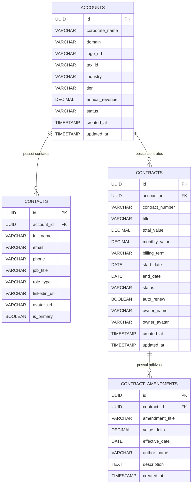

# ✦ CONTRACTPULSE CRM ENTERPRISE — BLUEPRINT OFICIAL ✦
## B2B Contract Lifecycle & Revenue Operations Platform

> **Portfólio Profissional — Projeto 18**  
> **Repositório GitHub:** `https://github.com/alxnrocha/java-crm`  
> **Stack:** React 19 • TypeScript 5.7 • Vite • Tailwind CSS v4 • Java 21 LTS • Spring Boot 3.3+ • Spring Data JPA • PostgreSQL 17 • Flyway • MapStruct • OpenAPI 3.0 • TanStack Table v8 • Recharts • JUnit 5 • Vitest

---

## 1. Visão Executiva do Produto

**ContractPulse** é uma plataforma corporativa de **Revenue Operations (RevenueOps) e Gestão do Ciclo de Vida de Contratos B2B (CLM)** concebida para médias e grandes empresas de tecnologia gerenciarem contas corporativas, contratos anuais de alto valor, histórico de aditivos (*amendments*) e métricas de receita recorrente (**MRR, ARR, Net Retention Rate e Churn**).

### Pilares de Negócio:
1. **Gestão de Contas Corporativas (Accounts):** Registro detalhado de clientes B2B (*Stripe, Cloudflare, Datadog, Snowflake, MongoDB*), indústria, faturamento anual e contatos-chave (*Decision Maker, Legal Counsel, Procurement*).
2. **Ciclo de Vida de Contratos (Contracts):** Máquina de estados com 4 fases formais: `Draft` ➔ `Legal Review` ➔ `Active` ➔ `Renewal`.
3. **Aditivos e Emendas Contratuais (Amendments):** Histórico auditável de acréscimo de licenças, serviços e variações financeiras.
4. **Motor de Métricas Financeiras (RevenueOps Analytics):** Cálculo em tempo real de Total ARR ($4.85M), Active MRR ($404k), Contratos a vencer em 90 dias e NRR (114.8%).

---

## 2. Arquitetura do Sistema

```text
18-java-crm/
├── client/                               # Frontend React 19 + TypeScript + Vite + Tailwind v4
│   ├── src/
│   │   ├── api/                          # Cliente HTTP tipado com suporte a modo Mock Standalone
│   │   ├── assets/                       # Estilos globais e tokens de design Enterprise Light
│   │   ├── components/
│   │   │   ├── dashboard/                # KPICards, RevenueSplineChart, StatusDonutChart
│   │   │   ├── contracts/                # TopContractsTable (TanStack Table), StatusPill
│   │   │   ├── drawer/                   # ContractDetailDrawer, VisualStepper, Stakeholders, Timeline
│   │   │   ├── modals/                   # NewContractModal, AmendmentModal, CommandPalette (⌘K)
│   │   │   ├── layout/                   # AppHeader, Sidebar, OrgSelector, UserProfile
│   │   │   └── ui/                       # Primitivas: Button, Card, Badge, Modal, Input, Select
│   │   ├── data/                         # Mock datasets e seeds realistas para preview no GitHub Pages
│   │   ├── stores/                       # Zustand 5 (Filtros, Contrato Selecionado, Drawer State)
│   │   ├── types/                        # Interfaces e DTOs TypeScript espelhados no backend
│   │   ├── App.tsx                       # Layout mestre responsivo
│   │   └── main.tsx                      # Ponto de entrada React
│   ├── package.json
│   ├── tsconfig.json
│   └── vite.config.ts
├── server/                               # Backend Java 21 LTS + Spring Boot 3.3+
│   ├── src/main/java/com/alxnrocha/crm/
│   │   ├── config/                       # OpenApiConfig, CorsConfig, JacksonConfig
│   │   ├── controller/                   # AccountController, ContractController, MetricsController
│   │   ├── dto/                          # Java 21 Records (AccountDTO, ContractDTO, MetricDTO)
│   │   ├── entity/                       # JPA Entities (@Entity Account, Contract, Amendment, Contact)
│   │   ├── enums/                        # ContractStatus, AccountTier, Industry, BillingTerm
│   │   ├── exception/                    # GlobalExceptionHandler (@RestControllerAdvice, RFC 7807)
│   │   ├── mapper/                       # MapStruct Mappers (Entity <-> DTO sem reflexão lenta)
│   │   ├── repository/                   # Spring Data JPA Repositories (JPQL queries)
│   │   ├── service/                      # AccountService, ContractService, RevenueMetricsService
│   │   └── ContractPulseApplication.java # Spring Boot Main Class
│   ├── src/main/resources/
│   │   ├── db/migration/                 # V1__initial_schema.sql, V2__seed_b2b_data.sql (Flyway)
│   │   └── application.yml               # Configuração do datasource, JPA e Swagger
│   ├── pom.xml                           # Configuração Maven com Java 21 e Spring Boot 3.3
│   └── mvnw / mvnw.cmd                   # Maven Wrapper para execução independente
├── compose.yaml                          # PostgreSQL 17 Alpine + PgAdmin
├── design/
│   ├── mockup.png                        # Mockup oficial de alta fidelidade
│   └── PROMPTS.md                        # Prompts de UI/UX (local, no .gitignore)
├── .github/workflows/deploy.yml          # CI/CD Pipeline (Maven build + Vitest + GitHub Pages)
├── .gitignore
├── BLUEPRINT.md
└── README.md
```

---

## 3. Modelo de Banco de Dados Relacional (PostgreSQL 17)



---

## 4. Endpoints REST da API (OpenAPI 3.0)

| Método | Rota | Descrição |
|---|---|---|
| `GET` | `/api/v1/metrics/overview` | Retorna KPIs executivos (ARR, MRR, Contratos a vencer, NRR) |
| `GET` | `/api/v1/metrics/revenue-growth` | Retorna histórico de crescimento mensal (Receita Real vs Meta) |
| `GET` | `/api/v1/metrics/status-distribution` | Retorna distribuição de contratos por status (Active, Review, etc.) |
| `GET` | `/api/v1/accounts` | Lista contas corporativas com filtros de indústria e tier |
| `GET` | `/api/v1/accounts/{id}` | Detalha uma conta corporativa com seus contatos |
| `POST` | `/api/v1/accounts` | Cadastra uma nova conta B2B com validação Jakarta |
| `GET` | `/api/v1/contracts` | Lista contratos paginados com busca, ordenação e filtros de status |
| `GET` | `/api/v1/contracts/{id}` | Detalha contrato com resumo financeiro, contatos e aditivos |
| `POST` | `/api/v1/contracts` | Cria um novo contrato corporativo |
| `PATCH` | `/api/v1/contracts/{id}/status` | Transiciona o status na máquina de estados (`Draft` -> `Review` -> `Active`) |
| `POST` | `/api/v1/contracts/{id}/renew` | Executa renovação com geração de aditivo e nova data de término |
| `POST` | `/api/v1/contracts/{id}/amendments` | Registra um aditivo contratual (*Amendment*) |

---

## 5. Estrutura de Milestones e 15 Issues

1. **Milestone 1: Setup do Projeto, Arquitetura Monorepo & Base UI** (`#1`, `#2`)
2. **Milestone 2: Modelo de Domínio Backend, Migrations Flyway & Repositórios JPA** (`#3`, `#4`)
3. **Milestone 3: Camada de Serviço, DTOs (Records), MapStruct & Motor de RevenueOps** (`#5`, `#6`)
4. **Milestone 4: REST Controllers, OpenAPI Swagger & Integração Client API** (`#7`, `#8`)
5. **Milestone 5: Dashboard Executivo, DataTables & Drawer de Ciclo de Vida** (`#9`, `#10`, `#11`, `#12`, `#13`)
6. **Milestone 6: Testes Automatizados, CI/CD Pipeline & Deploy** (`#14`, `#15`)
