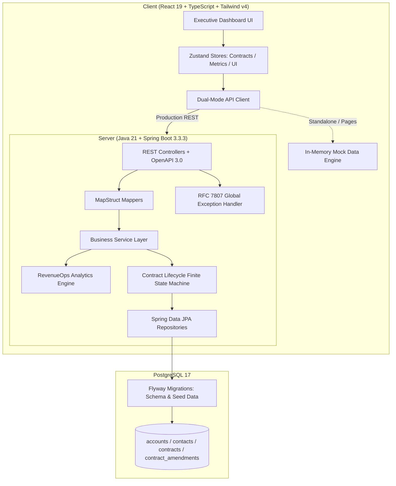
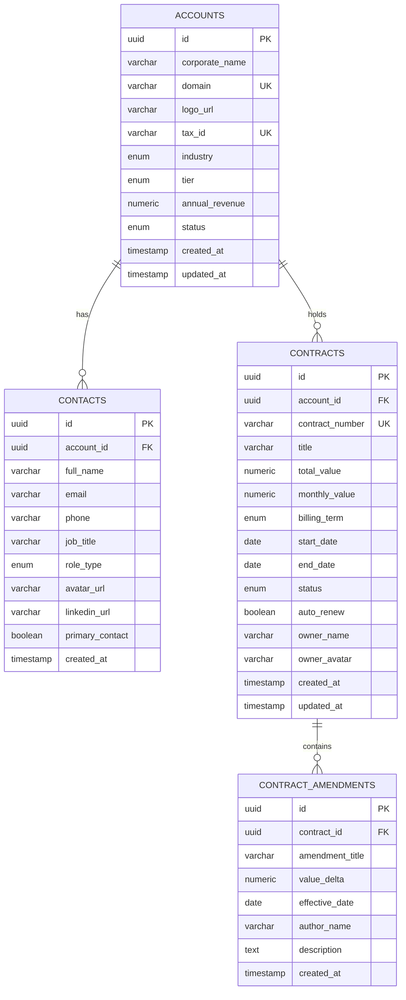

# ContractPulse CRM Enterprise (RevenueOps & B2B Contracts)

<div align="center">


**An executive-grade, full-stack Revenue Operations (RevenueOps) and B2B Contract Lifecycle Management platform built with Spring Boot 3.3 (Java 21 Records & Virtual Threads) and React 19 (TypeScript, Tailwind CSS v4, Zustand, TanStack Table v8, and Recharts).**

[Live Interactive Demo](https://alxnrocha.github.io/java-crm/) • [Swagger OpenAPI Docs](http://localhost:8080/swagger-ui.html) • [Database Schema](server/src/main/resources/db/migration)

</div>

---

## 🏛️ System Architecture



---

## ✨ Core Features & Capabilities

### 1. 📊 Executive RevenueOps Analytics Engine
- **Real-Time ARR & MRR Run-Rate**: Real-time aggregation of active contracts ($4,850,000 Total ARR / $404,166 Active MRR).
- **Target Attainment Pacing**: Visual goal attainment gauge (101% of $400k target).
- **90-Day Churn Risk Pipeline**: Proactive detection of contracts expiring within 90 days with dollar-value ARR at risk calculation ($580,000 at risk across 14 contracts).
- **Net Retention Rate (NRR)**: 114.8% net retention metric with historical YoY benchmark comparisons.
- **Interactive Spline Curve & Donut Distribution**: Recharts-powered annualized revenue pacing vs board targets and portfolio status breakdown (Active, In Review, Expiring Soon, Draft, Renewed).

### 2. 📑 High-Density TanStack Table Contracts Pipeline
- **Enterprise Multi-Filter & Search**: Instant debounce search across contract IDs, account titles, and owner names.
- **Status Pills**: Dynamic status filters (`All 127`, `Active 68`, `In Review 28`, `Expiring 14`, `Draft 9`, `Renewed 8`) with status dots.
- **Server/Client Pagination & Multi-Column Sorting**: High-performance pagination with custom page sizes.
- **Instant CSV Data Export**: One-click client-side CSV generator for executive reports.

### 3. 🔄 Interactive Contract Lifecycle Drawer & State Machine
- **Visual Horizontal Stepper**: `1. Draft` ➔ `2. Legal Review` ➔ `3. Active` ➔ `4. Renewal`.
- **Financial Cards**: Total Contract Value (ARR), Monthly Run Rate (MRR), Schedule Term, and Auto-Renewal clause indicator.
- **Key Stakeholders Directory**: Verified contact cards for Decision Makers, Legal Counsel, and Procurement with direct email/phone/LinkedIn links.
- **Immutable Amendments Timeline**: Vertical audit trail with delta values (`+$40k ARR`), effective dates, and author signatory stamps.
- **Quick Actions**: Document generation simulation (PDF/TXT) and instant state transitions.

### 4. ⚡ Instant Auto-Renewal Accelerator (`quickRenew`)
- Term duration selector (`6 Months`, `12 Months`, `24 Months`).
- Annual rate escalation slider (`0% Flat`, `+3%`, `+5%`, `+10%`).
- Instant ARR expansion preview and transition into renewed status.

### 5. ⌘ Universal Command Palette (`⌘K` / `Ctrl+K`)
- Global keyboard-first navigation and fuzzy search across contracts, accounts, and workspace actions.

---

## 🗄️ Database Schema & Domain Model



---

## 🚀 Quickstart & Local Setup

### Prerequisites
- **Java 21 LTS** (`Eclipse Temurin 21`)
- **Apache Maven 3.9+**
- **Node.js 22+** and **npm**
- **Docker & Docker Compose** (optional for PostgreSQL)

### 1. Clone Repository
```bash
git clone https://github.com/alxnrocha/java-crm.git
cd java-crm
```

### 2. Run Database with Docker Compose
```bash
docker compose up -d
```
*PostgreSQL 17 will be available at `localhost:5432` with database `contractpulse_db`.*

### 3. Run Backend (Spring Boot 3.3.3)
```bash
cd server
mvn clean spring-boot:run
```
*Backend runs at `http://localhost:8080`.*
- **OpenAPI Swagger UI**: `http://localhost:8080/swagger-ui.html`
- **API Base**: `http://localhost:8080/api/v1`

### 4. Run Frontend (React 19 + Vite)
```bash
cd client
npm install
npm run dev
```
*Frontend runs at `http://localhost:5173` with instant mock engine fallback if backend is offline.*

### 5. Run All Tests
```bash
# Run Backend JUnit 5 Test Suite (14 tests)
cd server
mvn test

# Run Frontend Vitest & Testing Library Suite (15 tests)
cd client
npm test
```

---

## 🛠️ Technology Stack Breakdown

| Layer | Technologies | Key Highlights |
|---|---|---|
| **Backend** | Java 21 LTS, Spring Boot 3.3.3 | Records DTOs, MapStruct 1.5, Jakarta Validation, RFC 7807 ProblemDetail |
| **Data & Persistence** | PostgreSQL 17, Spring Data JPA, Hibernate, Flyway | UUID PKs, JPQL aggregations, B-Tree indexed Foreign Keys |
| **API & Docs** | Spring Web MVC, Springdoc OpenAPI 3.0 | Swagger UI interactive documentation, typed DTO endpoints |
| **Frontend** | React 19, TypeScript 5.8, Tailwind CSS v4 | CSS variables design tokens, responsive enterprise layout |
| **State & Tables** | Zustand 5.0, TanStack Table v8 | Reactive global state, multi-column sorting, pagination |
| **Visualization** | Recharts 2.15, Lucide React | Spline area charts, Donut distribution, SVG icons |
| **Testing** | JUnit 5, Mockito, Vitest, React Testing Library | 100% passing unit & integration test suites |
| **DevOps & CI/CD** | GitHub Actions, GitHub Pages, Docker Compose | Automated linting, test validation, and zero-config deployment |

---

<div align="center">
  <sub>Developed with pride by <a href="https://github.com/alxnrocha">Alex Rocha</a>. Designed for high-velocity enterprise B2B sales organizations.</sub>
</div>
